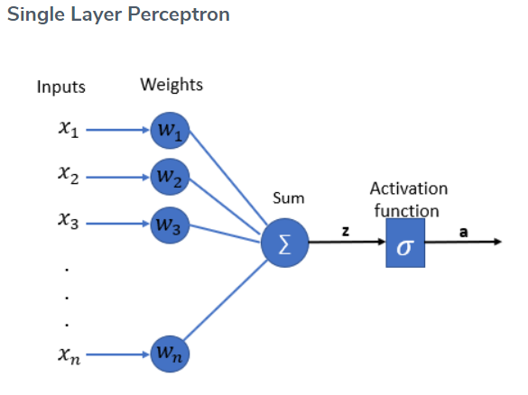
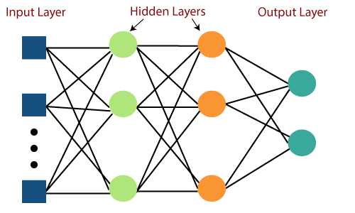

# MULTILAYER PERCEPTRON
#### A guide to using the Multilayer Perceptron (MLP) model in CVToolBox
Author: Vittorio Pivarci (Valkorz)

--- 

## What is a MLP?

A perceptron contains multiple features and inputs, that converge into a single binary output. It is simple, easy to use and easy to implement, however, it poses a great challenge: how can a traditional Perceptron deal with non-linear data?

In 1958, Frank Rosenblatt proposed the Multilayer Perceptron to target Perceptron's biggest flaws. between the input and output, the MLP also contains hidden layers, that provide complex data analysis and the ability to read non-linear data such as images!

